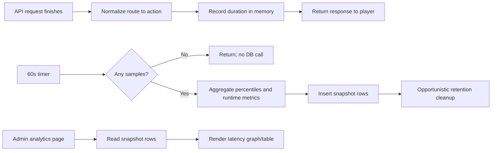

# API Latency Snapshots

**Date:** 2026-05-09
**Status:** Draft for user review

## Goal

Add an admin-only view of API response latency by gameplay action so PocketRealm can answer questions like:

- Is exploration slower than equipment changes, PvP, gathering, crafting, or combat?
- What are p50, p90, p95, and p99 response times right now?
- How do those percentiles change as connected players increase?
- Did a deployment or content change make a specific action materially slower?

The feature must collect enough historical data to graph latency over time without adding player-visible UI and without reintroducing fixed-cadence Neon Postgres activity while the site is idle.

## Non-Goals

- Not showing latency, warnings, debug banners, or diagnostics to normal players.
- Not storing individual request bodies, player IDs, IP addresses, auth data, item IDs, or route parameters.
- Not writing one database row per request.
- Not adding an external observability vendor or log-drain dependency.
- Not solving root-cause tracing for every slow action in this first pass. This design identifies which action is slow and when; deeper phase timings can be added once the slow paths are known.

## Hard Requirements

### Admin-only visibility

Only authenticated admins can read latency reports. The API routes live under the existing `adminRouter`, which already applies `authenticate` and `requireAdmin`. The web UI appears only inside the existing Admin panel.

### No player-facing UX

Player flows continue to behave exactly as they do today. Requests do not receive extra response fields, and the client does not render latency status.

### No idle Neon activity

The implementation must not wake Neon when the site is idle.

For this feature, idle means no non-health API requests are completing. While idle:

- The latency flush timer may wake in memory, but it must return before touching Prisma.
- No empty "zero traffic" buckets are inserted.
- No DB reads are performed to compute active player count.
- No retention cleanup runs on a standalone schedule.
- No health request is recorded as traffic for this feature.

The guard is explicit:

```typescript
setInterval(() => {
  if (!latencyBuffer.hasSamples()) return;
  void flushLatencySnapshots();
}, 60_000);
```

This timer is acceptable because it is in-process only when there are no samples. It must not call Prisma, Redis, or any other external service before `hasSamples()` confirms real traffic happened.

## Recommended Architecture

Use a two-stage collector:

1. **Request path:** record a tiny in-memory sample when an API response finishes.
2. **Flush path:** once per minute, if samples exist, aggregate them and write compact snapshot rows to Postgres.

This keeps gameplay requests independent of analytics persistence. A request only pays the cost of `Date.now()` or `performance.now()`, route/action normalization, and pushing one duration into an in-memory bucket.



## Data Model

Add a Prisma model backed by `api_latency_snapshots`.

```prisma
model ApiLatencySnapshot {
  id                String   @id @default(uuid())
  bucketStart       DateTime @map("bucket_start")
  bucketSizeSeconds Int      @map("bucket_size_seconds")
  action            String   @db.VarChar(64)
  method            String   @db.VarChar(8)
  route             String   @db.VarChar(160)

  requestCount      Int      @map("request_count")
  successCount      Int      @map("success_count")
  clientErrorCount  Int      @map("client_error_count")
  serverErrorCount  Int      @map("server_error_count")

  avgMs             Float    @map("avg_ms")
  minMs             Int      @map("min_ms")
  maxMs             Int      @map("max_ms")
  p50Ms             Int      @map("p50_ms")
  p75Ms             Int      @map("p75_ms")
  p90Ms             Int      @map("p90_ms")
  p95Ms             Int      @map("p95_ms")
  p99Ms             Int      @map("p99_ms")
  durationHistogram Json     @map("duration_histogram")

  activeConnections Int      @map("active_connections")
  connectedPlayers  Int      @map("connected_players")
  eventLoopLagMs    Float    @map("event_loop_lag_ms")
  memoryUsageMb     Float    @map("memory_usage_mb")

  createdAt         DateTime @default(now()) @map("created_at")

  @@unique([bucketStart, bucketSizeSeconds, action, method, route])
  @@index([bucketStart])
  @@index([action, bucketStart])
  @@map("api_latency_snapshots")
}
```

### Why snapshots, not raw requests

Raw per-request storage creates write amplification, increases retention pressure, and risks making monitoring part of the latency problem. Snapshot rows keep the table small: one row per action per minute with traffic.

### Why include a histogram

The exact p50/p95/p99 fields are exact for the one-minute sample. The histogram lets the admin API merge multiple one-minute rows into larger graph buckets without pretending that percentiles can be averaged exactly.

Use fixed millisecond buckets such as:

```typescript
[25, 50, 100, 200, 400, 800, 1600, 3200, 6400, 12800, Infinity]
```

The admin service can merge histogram counts for 5-minute, 1-hour, or 1-day views and estimate percentiles from the merged distribution.

## Action Classification

Each completed request is grouped into a stable action label.

Use Express route metadata where available:

- `method`: `GET`, `POST`, etc.
- `route`: normalized route template, e.g. `/api/v1/exploration/start`, `/api/v1/equipment/:slot`
- `action`: curated human-readable key

Initial curated labels:

| Method + route | Action |
|---|---|
| `POST /api/v1/exploration/start` | `exploration.start` |
| `POST /api/v1/exploration/estimate` | `exploration.estimate` |
| `POST /api/v1/zones/travel` | `zones.travel` |
| `POST /api/v1/equipment/*` | `equipment.change` |
| `POST /api/v1/combat/start` | `combat.start` |
| `POST /api/v1/combat/sites/:id/*` | `combat.site` |
| `POST /api/v1/pvp/*` | `pvp.action` |
| `POST /api/v1/gathering/*` | `gathering.action` |
| `POST /api/v1/crafting/*` | `crafting.action` |
| `POST /api/v1/inventory/*` | `inventory.action` |
| unmatched routes | normalized `METHOD route` |

Routes that must be excluded:

- `/health`, `/health/live`, `/health/ready`
- `GET /api/v1/admin/analytics/latency*`
- CORS preflight `OPTIONS`

Admin routes other than the latency endpoint may be recorded but should be hidden by default in the UI so admin graph polling does not dominate the gameplay view.

## Runtime Metrics

Each flushed snapshot row includes runtime context gathered in memory:

- Socket.IO `activeConnections`
- unique Socket.IO `connectedPlayers`
- event-loop lag from `monitorEventLoopDelay`
- heap usage in MB

Do not query `Player.lastActiveAt` to compute active players. The Socket.IO count is cheaper, does not touch Postgres, and is the right correlation for live load.

If a bucket has HTTP activity but no sockets, `connectedPlayers` can be zero. That is valid for login, registration, health-excluded probes, or unauthenticated API traffic.

## Flush Behavior

The flush service owns two buffers:

- an active in-memory buffer for current request samples
- a flushing buffer snapshot taken at timer time

On each tick:

1. If the active buffer is empty, return immediately with no external I/O.
2. Swap the active buffer with an empty buffer.
3. Aggregate samples by action/method/route.
4. Read runtime metrics from memory.
5. Insert rows with `createMany({ skipDuplicates: true })`.
6. Run retention cleanup only if enough time has elapsed since the last cleanup.

If insertion fails:

- log the error
- drop that bucket rather than blocking gameplay or growing memory without bound
- continue collecting future samples

This is monitoring data, not game state. Losing a minute of metrics is preferable to making player actions wait on analytics retries.

## Retention

Start with 30 days of one-minute rows. This is enough to compare normal day-to-day behavior and short enough to avoid unbounded growth.

Retention cleanup must be opportunistic:

- only after a successful snapshot flush or admin latency query
- at most once every 24 hours per process
- never from a fixed DB-touching background timer

The cleanup query deletes rows older than 30 days.

Future refinement can add daily rollups if production traffic makes the raw table too large.

## Admin API

Add routes under the existing diagnostics admin routes:

```http
GET /api/v1/admin/analytics/latency?period=1h
GET /api/v1/admin/analytics/latency?period=24h&action=exploration.start
GET /api/v1/admin/analytics/latency/actions?period=24h
```

Supported periods:

- `1h`
- `6h`
- `24h`
- `7d`
- `30d`

Response shape:

```typescript
interface LatencyReport {
  period: '1h' | '6h' | '24h' | '7d' | '30d';
  bucketSizeSeconds: number;
  generatedAt: string;
  actions: Array<{
    action: string;
    requestCount: number;
    avgMs: number;
    p50Ms: number;
    p90Ms: number;
    p95Ms: number;
    p99Ms: number;
    errorRate: number;
  }>;
  series: Array<{
    bucketStart: string;
    action: string;
    requestCount: number;
    avgMs: number;
    p50Ms: number;
    p90Ms: number;
    p95Ms: number;
    p99Ms: number;
    errorRate: number;
    connectedPlayers: number;
    activeConnections: number;
    eventLoopLagMs: number;
    memoryUsageMb: number;
  }>;
}
```

The admin service should fill missing graph buckets in the response or let the UI fill them. It must not store empty buckets in the database.

## Admin UI

Extend the existing Admin > Analytics tab with a Latency section.

Controls:

- period segmented control: `1h`, `6h`, `24h`, `7d`, `30d`
- action selector: all actions or a single action
- metric selector: p50, p95, p99, average

Views:

- compact line graph of selected latency metric over time
- connected players overlay or secondary line
- sortable table by action showing request count, p50, p95, p99, max, and error rate

The first implementation can use a small local SVG chart instead of adding a charting dependency. This keeps bundle and dependency churn low.

## Security and Privacy

Snapshot rows contain aggregate operational metrics only. They must not contain:

- player IDs
- account IDs
- usernames
- IP addresses
- auth tokens
- request bodies
- raw query strings
- specific item, mob, encounter, zone, or route parameter IDs

The route field uses normalized templates, not concrete URLs.

## Error Handling

- Metrics recording must never throw into the request path.
- Flush failures are logged at `warn` or `error` and do not affect API responses.
- Admin query failures return the standard API error response.
- If action normalization fails, record under `unknown` or fallback normalized route.

## Testing

Backend tests:

- percentile calculation returns expected p50, p75, p90, p95, p99 values
- histogram merge estimates percentiles from merged buckets
- `hasSamples() === false` causes the flush tick to make no Prisma calls
- flush writes one row per action/method/route when samples exist
- excluded routes are not recorded
- action normalization removes route parameters
- admin latency route requires existing admin middleware
- retention cleanup is throttled and never runs on empty flush

Frontend tests:

- Analytics tab fetches latency report for the selected period
- latency table renders action rows and percentile columns
- switching period/action refetches data
- empty report renders a no-data state

Manual verification:

- run focused API tests
- run focused web tests for Admin analytics
- run typecheck
- start API locally only if needed for manual endpoint inspection

## Open Questions

1. Should the first graph default to p95 or p99? Recommendation: p95 for the main graph, p99 available in the table.
2. Should admin routes be hidden by default or excluded entirely? Recommendation: record them, hide them by default, and always exclude the latency analytics endpoint itself.
3. Is 30 days of one-minute rows enough? Recommendation: start with 30 days and add rollups only if table size becomes meaningful.

## Implementation Order

After this design is approved:

1. Add Prisma model and migration for `api_latency_snapshots`.
2. Build the latency sample/aggregation service with unit tests first.
3. Add request middleware and timer startup with the no-samples/no-DB guard.
4. Add admin latency query service and routes.
5. Extend web API types and Admin > Analytics UI.
6. Run focused tests, simplify touched code, then run broader verification as needed.
